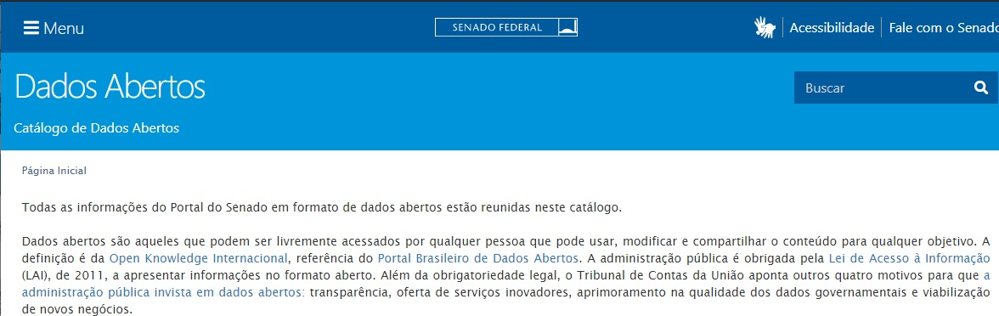

<!-- README.md is generated from README.Rmd. Please edit that file -->

# Monitor da CPI da Pandemia

## Contexto

<center>


</center>

É certo que o Brasil lidou e vem lidando muito mal com a pandemia da
COVID-19, que se mostrou ser muito mais grave do que uma *gripezinha*.
Depois de alcançar mais de centenas de milhares de óbitos em razão
direta da pandemia, o Senado Federal resolveu agir e instalou a “[CPI da
Pandemia](https://legis.senado.leg.br/comissoes/comissao?codcol=2441)”.

Não sem resistência do Governo Federal, que fez o que pôde para retirar
assinaturas e retardar ao máximo a instalação da Comissão, ela vem
trabalhando intensamente desde abril de 2021 e promete e reunir as
evidências de mal uso de recursos públicos, omissões dolosas e
responsabilizar as pessoas culpadas.

<center>


</center>

## O que é

Para ajudar a entender melhor esse contexto, os dados relativos à CPI
foram raspados diretamente do Senado Federal e tratados a fim de
permitir algumas análises e observar alguns comportamentos.

Podemos verificar a quantidade de tempo que cada parlamentar falou, a
diferença entre espaço que homens e mulheres receberam na Comissão, a
nuvem de palavras de cada uma das participantes (depoentes, testemunhas
e parlamentares) etc.

<center>


</center>

### Metodologia

Os dados foram obtidos utilizando [raspagem de
dados](https://pt.wikipedia.org/wiki/Coleta_de_dados_web) (web scrap)
diretamente do Senado Federal, que possui - junto à Câmara dos Deputados
- um ótimo sistema de dados abertos.

<center>



</center>

Foram acessadas cada uma das sessões da CPI e baixadas as transcrições
oficiais dos discursos. Naturalmente, pode haver algumas diferenças
entre o que foi transcrito e o efetivamente dito, mas o método além de
muito eficiente (muito melhor do que ouvir centenas de horas de
reuniões), é bastante confiável.

Esses discursos, com o nome de quem falou e o horário, foram organizados
numa base de dados. Posteriormente, ela foi limpa e acrescentadas
informações como o partido político, gênero, etc.

Os dados utilizados, bem como todos os scripts em R necessáros para
raspar, organizar, limpar e gerar a presente visualização estão
disponíveis no repositório do projeto no Github:
<https://github.com/rfdornelles/discursocpi>.

Ainda, você pode copiar diretamente usando o comando abaixo:

``` r
# install.packages("devtools")
devtools::install_github("rfdornelles/discursocpi")
```

### A fazer

O presente projeto foi apresentado originalmente como trabalho de
conclusão do (ótimo) curso de
[“Dashboards”](https://curso-r.com/cursos/dashboards/) da
[Curso-R](https://twitter.com/curso_r). Pretende-se, porém, torná-lo uma
ferramenta útil para a comunidade e por isso num futuro próximo espero
poder:

-   automatizar a raspagem dos dados através de GitHub Actions, a fim de
    que a base esteja atualizada diariamente
-   acrescentar os dados relativos aos requerimentos a serem avaliados
    pela CPI
-   analisar também os documentos que estejam públicos
-   mais visualizações úteis
-   classificar o alinhamento dos Senadores para que essa perspectiva
    possa ser considerada também nas análises (e permitir, por exemplo,
    saber as palavras mais usadas pelos governistas X oposicionistas)
-   incluir análises mais sofisticadas de análise de texto.

Naturalmente, nas próximas semanas também espero poder tornar os dados
raspados disponíveis também na [Base dos Dados, esse projeto sensacional
que recomendo conhecer](https://basedosdados.github.io/mais/).

## Contato

Caso queira contribuir com sugestões, críticas ou com alguma outra
coisa:

-   Repositório do projeto: <https://github.com/rfdornelles/discursocpi>

-   LinkedIn: <https://www.linkedin.com/in/rodrigo-dornelles-576705a2/>

Muito obrigado pela atenção, se puder fique em casa, use máscara e
vacine-se quando chegar sua vez!

<center>


</center>
